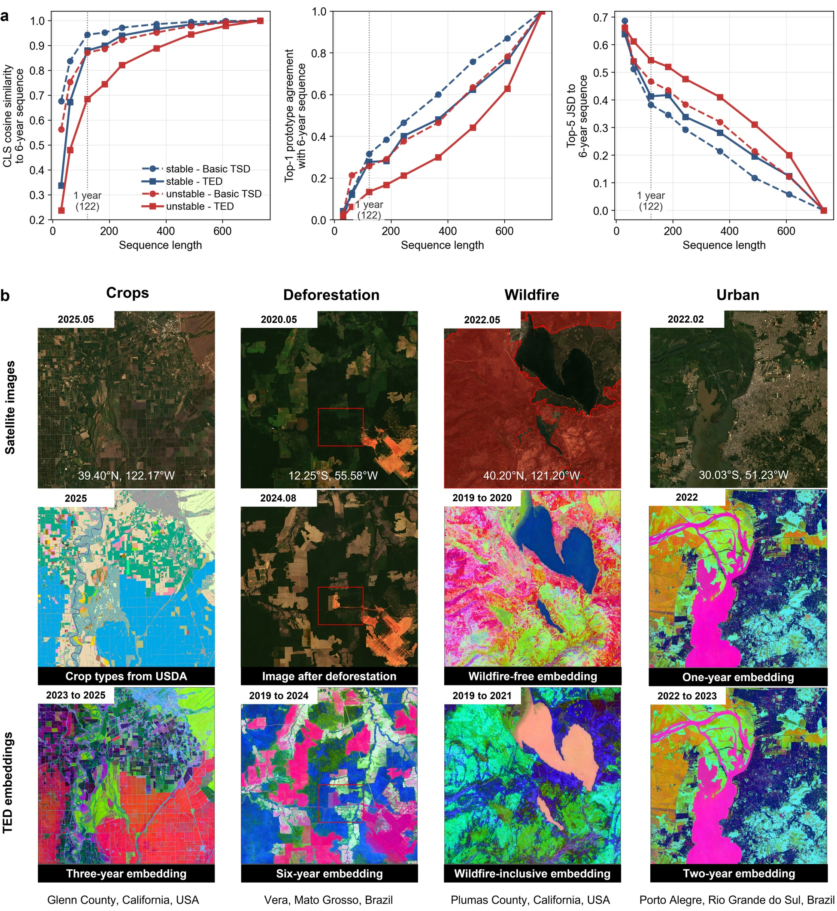

# Temporal Earth Distillation (TED)

Temporal Earth Distillation for pixel-based satellite image time series pre-training and downstream Earth observation tasks for evaluation.



**Figure 1 | Emergent semantic divergence and practical temporal embeddings.**
**a,** Semantic-state divergence across sequence lengths for trajectories selected by interannual normalised difference vegetation index (NDVI) variability. Basic TSD denotes basic temporal self-distillation; both Basic TSD and TED use the Small model and 20% of the pre-training data in this comparison. JSD denotes Jensen-Shannon divergence between the five most probable categorical semantic states. **b,** First three principal components of TED embeddings. Crop labels are from the United States Department of Agriculture Cropland Data Layer; the red outline in the wildfire scenario is the 2021 Dixie Fire perimeter from the California Fire and Resource Assessment Program.

## Quick Start

```bash
pip install -r requirements.txt
```

```python
from eval.load_pretrained import from_pretrained

model, config, family = from_pretrained("ted", device="cuda:0")
model.eval()
```

To reproduce the paper-aligned classification protocol:

```bash
CHECKPOINT=ted EVAL_MODE=linear DATASETS=all bash scripts/eval_downstream.sh
```

## Model Zoo

| Alias | Method | Size | Checkpoint metadata |
|-------|--------|------|---------------------|
| `ted` | Temporal Earth Distillation | 12-layer, 768-dim | `pretrained/ted-hls-12b768/config.json` |
| `msm` | Masked Sequence Modeling | 12-layer, 768-dim | `pretrained/msm-hls-12b768/config.json` |
| `ntp` | Next-Token Prediction | 12-layer, 768-dim | `pretrained/ntp-hls-12b768/config.json` |

Large pretrained weights are not tracked by git. Place `pytorch_model.bin` under the matching `pretrained/*/` folder, or set `PRETRAINED_BUNDLE` when using `scripts/ensure_pretrained_weights.sh`.

## Requirements

Python **≥ 3.10**. Install:

```bash
cd temporal_earth_distillation
pip install -r requirements.txt
```

| Package | Role |
|---------|------|
| `torch` | training / eval |
| `numpy`, `pandas`, `scipy`, `scikit-learn` | arrays, metrics, probes |
| `h5py`, `netCDF4` | HLS / classification NetCDF (HDF5-backed) |
| `einops` | transformer blocks |
| `matplotlib` | training curves |

GPU training expects CUDA-enabled PyTorch matching your driver.

## Layout

```text
temporal_earth_distillation/
├── train.py                 # SSL pretraining CLI (TED / MSM / NTP / Imputator)
├── eval_downstream.py       # downstream classification CLI
├── models/                  # ted.py, msm.py, ntp.py, imputator.py
├── modules/                 # Backbone + sequence-state / patch-state heads
├── layers/
├── data/
│   ├── hls_dataset.py       # pretraining loader (HLS only)
│   ├── factory.py
│   ├── downstream_datasets.py
│   └── downstream_factory.py
├── engine/                  # SSLTrainer
├── eval/                    # linear probe, kNN, spatial splits, zoo loader
├── utils/
├── scripts/
│   ├── train_ted_12b768.sh
│   ├── train_msm_*.sh
│   ├── train_ntp_*.sh
│   ├── eval_downstream.sh
│   └── ensure_pretrained_weights.sh
├── pretrained/              # HF-style zoo (config.json + weights)
│   ├── ted-hls-12b768/
│   ├── msm-hls-12b768/
│   └── ntp-hls-12b768/
└── dataset/downstream/classification/
```

## Data

### Pretraining (not bundled)

Place under `--root_path` / `ROOT_PATH` (default `./dataset/`):

- `train.nc` or `train.h5` (required)
- `val.nc` / `val.h5` (optional)

See `dataset/README.md`.

### Downstream (bundled)

Five classification tasks under `dataset/downstream/classification/`:

- `hls_composite_nc/*_hls_classification_processed.nc`
- `*_hls_classification.npz` (lon/lat helpers for spatial splits)

## Train

```bash
pip install -r requirements.txt

ROOT_PATH=/path/to/dir_with_train.nc \
DEVICES=0,1,2,3,4,5,6,7 NPROC_PER_NODE=8 \
bash scripts/train_ted_12b768.sh

ROOT_PATH=/path/to/dir_with_train.nc bash scripts/train_msm_12b768.sh
ROOT_PATH=/path/to/dir_with_train.nc bash scripts/train_ntp_12b768.sh
```

Single-GPU smoke:

```bash
ROOT_PATH=/path/to/dir_with_train.nc \
DEVICES=0 NPROC_PER_NODE=1 USE_MULTI_GPU=0 \
MAX_TRAIN_STEPS=5 BATCH_SIZE=8 NUM_WORKERS=0 \
bash scripts/train_msm_12b768.sh
```

## Downstream evaluation

Default protocol (paper tables):

- TerraFM-style **2:1:1** split
- **spatial 1280 m** grid + proximity filter
- **cap300** (`max_train_per_class=300`; `0` = nocap)
- **linear** probe (LR grid on val BA) or **kNN**
- MSM pooling: `patch_avg`
- Primary metric: test **balanced accuracy (ba)**

Released anchors live under `pretrained/` (aliases `ted` / `msm` / `ntp`). Weights are gitignored; on this machine they ship as `pretrained/*/pytorch_model.bin`. If missing:

```bash
bash scripts/ensure_pretrained_weights.sh
# optional: PRETRAINED_BUNDLE=/path/to/pretrained_release
```

```bash
CHECKPOINT=ted EVAL_MODE=linear DATASETS=all bash scripts/eval_downstream.sh
CHECKPOINT=msm bash scripts/eval_downstream.sh
CHECKPOINT=ntp bash scripts/eval_downstream.sh

python eval_downstream.py \
  --checkpoint ted-hls-12b768 \
  --eval_mode linear \
  --datasets all \
  --downstream_data_root ./dataset/downstream/classification \
  --spatial_block_m 1280 \
  --max_train_per_class 300 \
  --output_csv results/downstream_ted_linear_cap300.csv
```

Python load:

```python
from eval.load_pretrained import from_pretrained
model, config, family = from_pretrained("ted", device="cuda:0")
```

Details: `pretrained/README.md`.

## Models

| `--model` | Module | Notes |
|-----------|--------|-------|
| `TED` | `models/ted.py` | Temporal Earth Distillation |
| `MSM` | `models/msm.py` | Masked Sequence Modeling |
| `NTP` | `models/ntp.py` | Next-Token Prediction |
| `Imputator` | `models/imputator.py` | optional observation imputation module |

Legacy name aliases (`TED_modular`, `Patch_Masked`, `Patch_NTP_TED`, `Transformer`) still resolve at train time.

Released recipes correspond to the paper-scale TED, MSM and NTP checkpoints in `pretrained/`. The matching training entry points are `scripts/train_ted_12b768.sh`, `scripts/train_msm_12b768.sh` and `scripts/train_ntp_12b768.sh`; historical run identifiers are kept only in checkpoint metadata for traceability.

## Paper

This repository accompanies the Temporal Earth Distillation manuscript and provides the reference implementation, paper-scale training recipes, pretrained-checkpoint metadata and downstream evaluation code.

## Citation

Please cite the project using `CITATION.cff`. A manuscript BibTeX entry will be added after publication.

## Data and Code Availability

Code, configuration files, downstream evaluation metadata and release instructions are maintained in this repository. Large pretrained weights and HLS pretraining files are not stored directly in git; use `pretrained/README.md` and `dataset/README.md` for the expected file layout.

## Notes

- `train.py` is train-only (`if __name__ == "__main__"`). The public data loaders are scoped to HLS satellite image time series.
- TED-specific flags default **off**; paper TED recipes set them in `scripts/train_ted_*.sh`.
- License: MIT (`LICENSE`). Citation: `CITATION.cff`.
