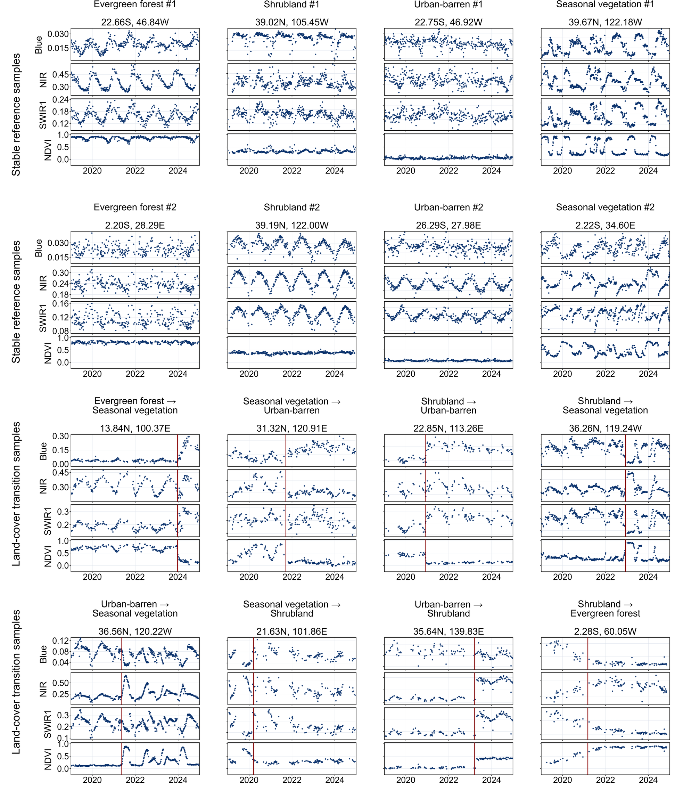
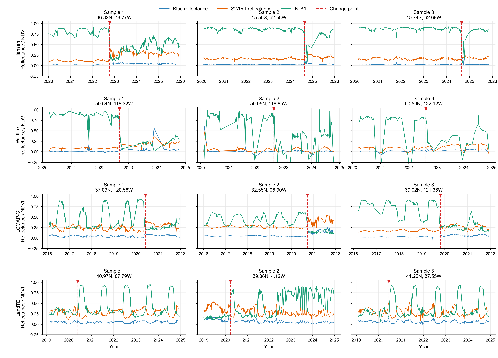
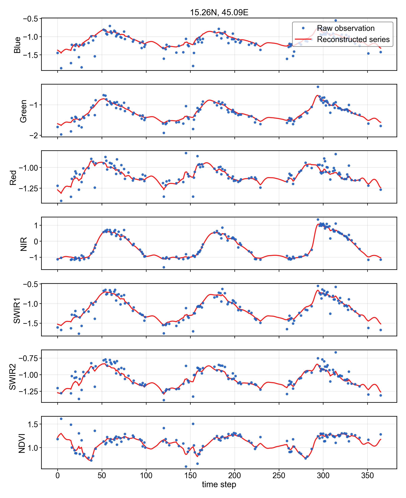
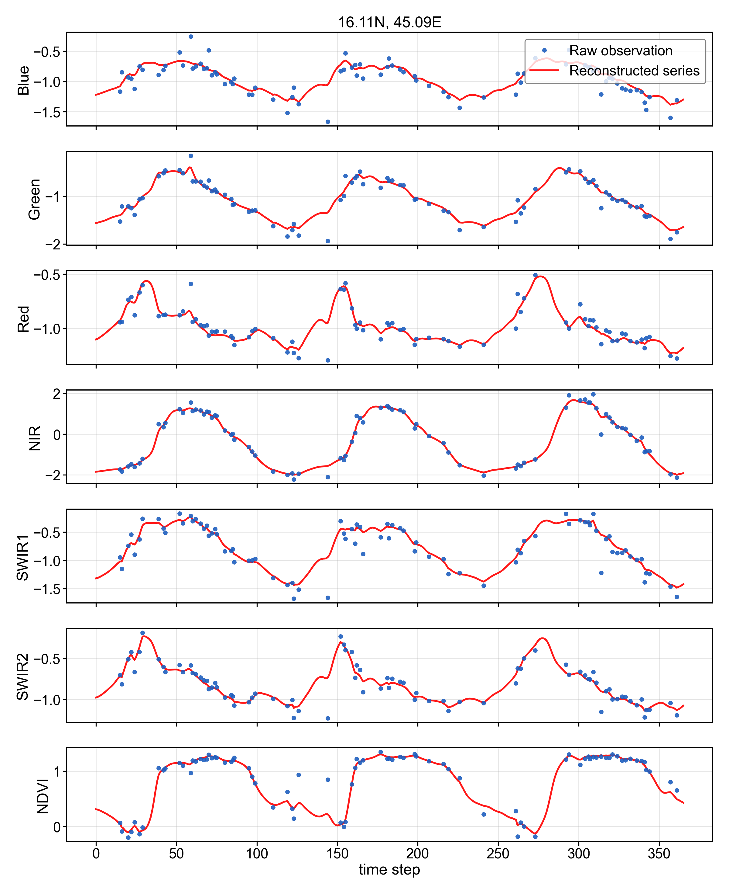

# Downstream Datasets

This page summarizes the downstream evaluation artifacts bundled with the Temporal Earth Distillation release. The table follows the paper's Extended Data Table 1.

## Dataset Summary

| Dataset | Task | Label or event source | Classes or event type | Years | Sites |
|---------|------|-----------------------|-----------------------|-------|-------|
| LCMAP | Classification | USGS LCMAP Collection 1.3 reference data | Barren, cropland, developed, grass/shrub, tree cover, water and wetland | 2016-2021 | 17,778 |
| GlanCE | Classification | GlanCE annual land-cover labels | Water, developed, barren/sparsely vegetated, trees, shrubs and herbaceous | 2014-2019 | 10,100 |
| GlobalTree | Classification | GlobalTree tree functional-type labels | Deciduous broadleaf, evergreen broadleaf, deciduous needleleaf and evergreen needleleaf | 2022-2024 | 4,000 |
| CDL | Classification | USDA NASS Cropland Data Layer 2023 | Corn, cotton, rice, sorghum, soybeans, sunflower, peanuts, tobacco, sweet corn, pop/ornamental corn and mint | 2023 | 11,000 |
| CropHarvest | Classification | CropHarvest crop-label records | Sixteen coarse crop groups pooled from single-year samples | 2019-2022 | 15,802 |
| Hansen | Change detection | Hansen Global Forest Change v1.12 | Forest-loss event; exact dates manually confirmed from HLS trajectories | 2020-2025 | 1,135 |
| Wildfire | Change detection | Canada NFDB and Geoscience Australia bushfire polygons | Wildfire event; exact dates manually curated from source event dates and HLS review | 2020-2024 | 840 |
| LCMAP-C | Change detection | USGS LCMAP Collection 1.3 reference data | Land-cover change process; exact dates manually annotated from HLS trajectories | 2016-2021 | 110 |
| LandTD | Change detection | Internally curated state-transition records | Land-state transition event | 2019-2024 | 1,879 |

## Bundled Files

Classification artifacts are in `dataset/downstream/classification/`:

- HLS composites: `hls_composite_nc/*_hls_classification_processed.nc`
- AlphaEarth comparison features: `*_alphaearth_classification.npz`

Change-detection artifacts are in `dataset/downstream/change_detection/`:

- Event metadata and labels: `*_hls_change_detection.npz`
- HLS composites: `hls_composite_nc/*_hls_change_detection_processed.nc`

## Dataset Visualizations

**Stable reference and land-cover transition examples.** Representative HLS time series are shown for stable reference samples and land-cover transition samples. Red vertical lines mark annotated transition dates.

**Change-detection examples.** Example HLS trajectories used to inspect event timing and spectral behaviour around annotated changes.

## Imputation Examples

**Imputation examples.** Example trajectories show raw observations, artificially masked observations and the output of the separately trained imputator used in the missingness/imputation analysis.